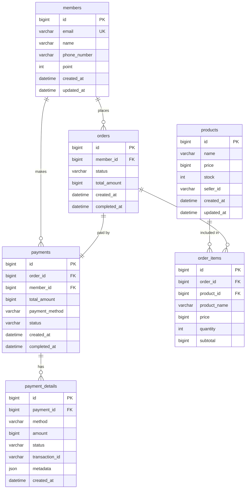

# 캐시노트 마켓 데이터베이스 ERD

## 목차
1. [데이터베이스 개요](#데이터베이스-개요)
2. [ERD (Entity Relationship Diagram)](#erd-entity-relationship-diagram)
3. [테이블 상세 설명](#테이블-상세-설명)
4. [인덱스 전략](#인덱스-전략)
5. [제약사항 및 주의사항](#제약사항-및-주의사항)
6. [파티셔닝 전략](#파티셔닝-전략)
7. [백업 및 복구 전략](#백업-및-복구-전략)

## 데이터베이스 개요

### 기본 정보
- **DBMS**: MySQL 8.0
- **Database Name**: shop
- **Character Set**: utf8mb4
- **Collation**: utf8mb4_unicode_ci
- **Storage Engine**: InnoDB

### 설계 원칙
1. **정규화**: 3차 정규형까지 적용
2. **일관성**: 외래키 제약조건 적용
3. **성능**: 적절한 인덱스 설계
4. **확장성**: 파티셔닝 고려

## ERD (Entity Relationship Diagram)



## 테이블 상세 설명

### 1. members (회원)
회원 정보를 저장하는 테이블입니다.

```sql
CREATE TABLE members (
    id BIGINT AUTO_INCREMENT PRIMARY KEY,
    email VARCHAR(255) UNIQUE NOT NULL,
    name VARCHAR(100) NOT NULL,
    phone_number VARCHAR(20) NOT NULL,
    point INT DEFAULT 0,
    created_at DATETIME DEFAULT CURRENT_TIMESTAMP,
    updated_at DATETIME DEFAULT CURRENT_TIMESTAMP ON UPDATE CURRENT_TIMESTAMP,
    
    INDEX idx_email (email),
    INDEX idx_phone (phone_number)
) ENGINE=InnoDB DEFAULT CHARSET=utf8mb4 COLLATE=utf8mb4_unicode_ci;
```

**컬럼 설명**
- `id`: 회원 고유 식별자
- `email`: 이메일 주소 (로그인 ID로 사용)
- `name`: 회원 이름
- `phone_number`: 휴대폰 번호
- `point`: 보유 포인트
- `created_at`: 가입일시
- `updated_at`: 최종 수정일시

### 2. products (상품)
상품 정보를 저장하는 테이블입니다.

```sql
CREATE TABLE products (
    id BIGINT AUTO_INCREMENT PRIMARY KEY,
    name VARCHAR(200) NOT NULL,
    price BIGINT NOT NULL CHECK (price >= 0),
    stock INT NOT NULL CHECK (stock >= 0),
    seller_id VARCHAR(100) NOT NULL,
    created_at DATETIME DEFAULT CURRENT_TIMESTAMP,
    updated_at DATETIME DEFAULT CURRENT_TIMESTAMP ON UPDATE CURRENT_TIMESTAMP,
    
    INDEX idx_seller (seller_id),
    INDEX idx_name (name),
    INDEX idx_price (price)
) ENGINE=InnoDB DEFAULT CHARSET=utf8mb4 COLLATE=utf8mb4_unicode_ci;
```

**컬럼 설명**
- `id`: 상품 고유 식별자
- `name`: 상품명
- `price`: 가격 (원 단위)
- `stock`: 재고 수량
- `seller_id`: 판매자 식별자
- `created_at`: 등록일시
- `updated_at`: 최종 수정일시

### 3. orders (주문)
주문 정보를 저장하는 테이블입니다.

```sql
CREATE TABLE orders (
    id BIGINT AUTO_INCREMENT PRIMARY KEY,
    member_id BIGINT NOT NULL,
    status VARCHAR(20) NOT NULL DEFAULT 'PENDING',
    total_amount BIGINT NOT NULL,
    created_at DATETIME DEFAULT CURRENT_TIMESTAMP,
    completed_at DATETIME NULL,
    
    FOREIGN KEY (member_id) REFERENCES members(id),
    INDEX idx_member_date (member_id, created_at),
    INDEX idx_status (status),
    INDEX idx_created_at (created_at)
) ENGINE=InnoDB DEFAULT CHARSET=utf8mb4 COLLATE=utf8mb4_unicode_ci;
```

**컬럼 설명**
- `id`: 주문 고유 식별자
- `member_id`: 주문한 회원 ID
- `status`: 주문 상태 (PENDING, PAID, CANCELLED, COMPLETED)
- `total_amount`: 총 주문 금액
- `created_at`: 주문 생성일시
- `completed_at`: 주문 완료일시

### 4. order_items (주문 상품)
주문에 포함된 상품 정보를 저장하는 테이블입니다.

```sql
CREATE TABLE order_items (
    id BIGINT AUTO_INCREMENT PRIMARY KEY,
    order_id BIGINT NOT NULL,
    product_id BIGINT NOT NULL,
    product_name VARCHAR(200) NOT NULL,
    price BIGINT NOT NULL,
    quantity INT NOT NULL,
    subtotal BIGINT NOT NULL,
    
    FOREIGN KEY (order_id) REFERENCES orders(id),
    FOREIGN KEY (product_id) REFERENCES products(id),
    INDEX idx_order_id (order_id),
    INDEX idx_product_id (product_id)
) ENGINE=InnoDB DEFAULT CHARSET=utf8mb4 COLLATE=utf8mb4_unicode_ci;
```

**컬럼 설명**
- `id`: 주문 상품 고유 식별자
- `order_id`: 주문 ID
- `product_id`: 상품 ID
- `product_name`: 주문 당시 상품명 (스냅샷)
- `price`: 주문 당시 단가 (스냅샷)
- `quantity`: 주문 수량
- `subtotal`: 소계 (price × quantity)

### 5. payments (결제)
결제 정보를 저장하는 테이블입니다.

```sql
CREATE TABLE payments (
    id BIGINT AUTO_INCREMENT PRIMARY KEY,
    order_id BIGINT NOT NULL UNIQUE,
    member_id BIGINT NOT NULL,
    total_amount BIGINT NOT NULL,
    payment_method VARCHAR(20) NOT NULL,
    status VARCHAR(20) NOT NULL DEFAULT 'PROCESSING',
    created_at DATETIME DEFAULT CURRENT_TIMESTAMP,
    completed_at DATETIME NULL,
    
    FOREIGN KEY (order_id) REFERENCES orders(id),
    FOREIGN KEY (member_id) REFERENCES members(id),
    INDEX idx_member_id (member_id),
    INDEX idx_status (status),
    INDEX idx_created_at (created_at)
) ENGINE=InnoDB DEFAULT CHARSET=utf8mb4 COLLATE=utf8mb4_unicode_ci;
```

**컬럼 설명**
- `id`: 결제 고유 식별자
- `order_id`: 주문 ID (1:1 관계)
- `member_id`: 결제한 회원 ID
- `total_amount`: 총 결제 금액
- `payment_method`: 결제 방법 (PG_KPN, CASHNOTE_POINT, BNPL, COMPOSITE)
- `status`: 결제 상태 (PROCESSING, COMPLETED, FAILED, CANCELLED)
- `created_at`: 결제 시작일시
- `completed_at`: 결제 완료일시

### 6. payment_details (결제 상세)
복합결제 시 각 결제 수단별 상세 정보를 저장하는 테이블입니다.

```sql
CREATE TABLE payment_details (
    id BIGINT AUTO_INCREMENT PRIMARY KEY,
    payment_id BIGINT NOT NULL,
    method VARCHAR(20) NOT NULL,
    amount BIGINT NOT NULL,
    status VARCHAR(20) NOT NULL DEFAULT 'PENDING',
    transaction_id VARCHAR(100) NULL,
    metadata JSON NULL,
    created_at DATETIME DEFAULT CURRENT_TIMESTAMP,
    
    FOREIGN KEY (payment_id) REFERENCES payments(id),
    INDEX idx_payment_id (payment_id),
    INDEX idx_transaction_id (transaction_id)
) ENGINE=InnoDB DEFAULT CHARSET=utf8mb4 COLLATE=utf8mb4_unicode_ci;
```

**컬럼 설명**
- `id`: 결제 상세 고유 식별자
- `payment_id`: 결제 ID
- `method`: 결제 수단 (PG_KPN, CASHNOTE_POINT, COUPON)
- `amount`: 해당 결제 수단으로 결제한 금액
- `status`: 결제 상태 (PENDING, SUCCESS, FAILED)
- `transaction_id`: 외부 거래 ID
- `metadata`: 추가 정보 (JSON 형식)
- `created_at`: 생성일시

## 인덱스 전략

### 1. Primary Key 인덱스
모든 테이블의 `id` 컬럼에 자동 생성

### 2. Unique 인덱스
- `members.email`: 이메일 중복 방지
- `payments.order_id`: 주문당 하나의 결제만 허용

### 3. 일반 인덱스

#### 조회 성능 향상
```sql
-- 회원별 주문 조회
CREATE INDEX idx_orders_member_date ON orders(member_id, created_at DESC);

-- 상태별 주문 조회
CREATE INDEX idx_orders_status ON orders(status);

-- 판매자별 상품 조회
CREATE INDEX idx_products_seller ON products(seller_id);

-- 가격대별 상품 조회
CREATE INDEX idx_products_price ON products(price);
```

#### 복합 인덱스
```sql
-- 회원의 특정 기간 주문 조회
CREATE INDEX idx_orders_member_status_date 
ON orders(member_id, status, created_at DESC);

-- 결제 상태별 조회
CREATE INDEX idx_payments_status_date 
ON payments(status, created_at DESC);
```

### 4. 커버링 인덱스
자주 사용되는 쿼리에 대해 커버링 인덱스 적용

```sql
-- 주문 목록 조회 시 JOIN 최소화
CREATE INDEX idx_order_items_covering 
ON order_items(order_id, product_id, price, quantity, subtotal);
```

## 제약사항 및 주의사항

### 1. 외래키 제약사항
- 모든 외래키는 `ON DELETE RESTRICT` 설정
- 참조 무결성 보장
- 삭제 시 관련 데이터 확인 필요

### 2. 데이터 타입 고려사항
- **금액 필드**: `BIGINT` 사용 (소수점 처리 불필요)
- **상태 필드**: `VARCHAR(20)` 사용 (ENUM 대신 확장성 고려)
- **JSON 필드**: `metadata`는 구조화되지 않은 데이터 저장

### 3. 성능 고려사항
- 대용량 테이블은 파티셔닝 적용
- 인덱스는 쓰기 성능에 영향을 주므로 필요한 것만 생성
- `VARCHAR` 길이는 실제 필요한 크기로 제한

### 4. 데이터 정합성
- 재고 차감은 트랜잭션 내에서 처리
- 포인트 차감/환불은 별도 이력 관리 필요
- 주문 취소 시 관련 데이터 상태 동기화

## 파티셔닝 전략

### 1. 시간 기반 파티셔닝 (orders, payments)
```sql
ALTER TABLE orders 
PARTITION BY RANGE (YEAR(created_at)) (
    PARTITION p2024 VALUES LESS THAN (2025),
    PARTITION p2025 VALUES LESS THAN (2026),
    PARTITION p2026 VALUES LESS THAN (2027),
    PARTITION p_future VALUES LESS THAN MAXVALUE
);
```

### 2. 해시 기반 파티셔닝 (members)
```sql
ALTER TABLE members 
PARTITION BY HASH(id) 
PARTITIONS 10;
```

### 3. 파티셔닝 이점
- 쿼리 성능 향상 (파티션 프루닝)
- 관리 용이성 (오래된 데이터 아카이빙)
- 병렬 처리 가능

## 백업 및 복구 전략

### 1. 백업 정책
- **전체 백업**: 매주 일요일 02:00
- **증분 백업**: 매일 02:00
- **트랜잭션 로그 백업**: 매시간

### 2. 백업 스크립트
```bash
#!/bin/bash
# 전체 백업
mysqldump -u root -p \
  --single-transaction \
  --routines \
  --triggers \
  --events \
  --databases shop \
  > /backup/shop_full_$(date +%Y%m%d).sql

# 테이블별 백업
for table in members products orders order_items payments payment_details
do
  mysqldump -u root -p shop $table \
    > /backup/shop_${table}_$(date +%Y%m%d).sql
done
```

### 3. 복구 절차
```sql
-- 전체 복구
mysql -u root -p < /backup/shop_full_20240120.sql

-- 특정 시점 복구 (PITR)
mysqlbinlog --start-datetime="2024-01-20 10:00:00" \
            --stop-datetime="2024-01-20 11:00:00" \
            /var/log/mysql/binlog.000001 | mysql -u root -p
```

### 4. 재해 복구
- **RPO (Recovery Point Objective)**: 1시간
- **RTO (Recovery Time Objective)**: 4시간
- **복제 구성**: Master-Slave 복제
- **백업 저장소**: 원격 스토리지 (S3, Cloud Storage)

## 데이터베이스 모니터링

### 1. 주요 모니터링 지표
```sql
-- 슬로우 쿼리 확인
SELECT * FROM mysql.slow_log 
WHERE query_time > 1 
ORDER BY query_time DESC;

-- 테이블 크기 확인
SELECT 
    table_name,
    ROUND(((data_length + index_length) / 1024 / 1024), 2) AS size_mb
FROM information_schema.tables
WHERE table_schema = 'shop'
ORDER BY size_mb DESC;

-- 인덱스 사용률 확인
SELECT 
    table_name,
    index_name,
    cardinality
FROM information_schema.statistics
WHERE table_schema = 'shop'
ORDER BY cardinality DESC;
```

### 2. 성능 튜닝 포인트
- Query Cache 활성화
- Buffer Pool 크기 최적화
- Connection Pool 설정
- Slow Query 분석 및 최적화

## 마이그레이션 전략

### 1. 스키마 버전 관리
- Flyway 또는 Liquibase 사용
- 마이그레이션 스크립트 버전 관리
- 롤백 스크립트 준비

### 2. 무중단 마이그레이션
```sql
-- 1. 새 컬럼 추가 (NULL 허용)
ALTER TABLE products ADD COLUMN category VARCHAR(50) NULL;

-- 2. 데이터 마이그레이션
UPDATE products SET category = 'DEFAULT' WHERE category IS NULL;

-- 3. NOT NULL 제약 추가
ALTER TABLE products MODIFY COLUMN category VARCHAR(50) NOT NULL;
```

## 보안 고려사항

### 1. 접근 제어
```sql
-- 애플리케이션 사용자 생성
CREATE USER 'app_user'@'%' IDENTIFIED BY 'strong_password';

-- 최소 권한 부여
GRANT SELECT, INSERT, UPDATE ON shop.* TO 'app_user'@'%';
GRANT DELETE ON shop.order_items TO 'app_user'@'%';

-- 민감 데이터 접근 제한
REVOKE ALL ON shop.payment_details FROM 'app_user'@'%';
GRANT SELECT (id, payment_id, method, amount, status) 
ON shop.payment_details TO 'app_user'@'%';
```

### 2. 데이터 암호화
- TDE (Transparent Data Encryption) 적용
- 민감 정보 컬럼 암호화
- 백업 파일 암호화

### 3. 감사 로그
```sql
-- 감사 플러그인 활성화
INSTALL PLUGIN audit_log SONAME 'audit_log.so';

-- 감사 설정
SET GLOBAL audit_log_format = 'JSON';
SET GLOBAL audit_log_policy = 'ALL';
```

## 결론

이 ERD는 캐시노트 마켓의 핵심 비즈니스 요구사항을 반영하여 설계되었습니다. 
정규화를 통해 데이터 중복을 최소화하고, 적절한 인덱스를 통해 조회 성능을 최적화했습니다. 
향후 서비스 확장에 따라 파티셔닝, 샤딩 등의 고급 기법을 적용하여 확장성을 확보할 수 있습니다.

---

최종 업데이트: 2024년 1월 20일
