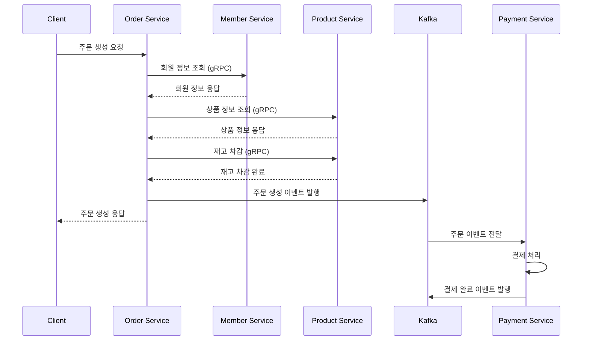

# 캐시노트 마켓 주문 서비스 구현 설명서

## 목차
1. [프로젝트 개요](#프로젝트-개요)
2. [설계 구조](#설계-구조)
3. [설계 시 고민사항](#설계-시-고민사항)
4. [구현 상세](#구현-상세)
5. [개선 방향](#개선-방향)
6. [제약사항](#제약사항)
7. [트래픽 증가 대응 방안](#트래픽-증가-대응-방안)
8. [기타 설명](#기타-설명)

## 프로젝트 개요

캐시노트 마켓은 다양한 판매자가 다양한 상품을 다양한 결제수단으로 판매하는 이커머스 플랫폼입니다. 
본 프로젝트는 마이크로서비스 아키텍처와 헥사고날 아키텍처를 적용하여 확장 가능하고 유지보수가 용이한 시스템을 구축했습니다.

### 핵심 요구사항
- 복합결제 지원 (PG + 포인트 + 쿠폰)
- BNPL(Buy Now Pay Later) 단독 결제
- 결제 수단별 제약사항 처리
- 분산 환경에서의 데이터 일관성 보장

## 설계 구조

### 1. 전체 아키텍처

```
┌─────────────────────────────────────────────────────────────────┐
│                         Client Layer                             │
│                    (Web, Mobile, API Gateway)                    │
└─────────────────────────────────────────────────────────────────┘
                                  │
                                  ▼
┌─────────────────────────────────────────────────────────────────┐
│                      Application Layer                           │
│  ┌─────────────┐  ┌─────────────┐  ┌─────────────┐  ┌─────────┐│
│  │   Member    │  │   Product   │  │    Order    │  │ Payment ││
│  │   Service   │  │   Service   │  │   Service   │  │ Service ││
│  └─────────────┘  └─────────────┘  └─────────────┘  └─────────┘│
└─────────────────────────────────────────────────────────────────┘
           │                │                │               │
           ▼                ▼                ▼               ▼
┌─────────────────────────────────────────────────────────────────┐
│                    Infrastructure Layer                          │
│  ┌─────────────┐  ┌─────────────┐  ┌─────────────┐            │
│  │    MySQL    │  │    Kafka    │  │    gRPC     │            │
│  │  Database   │  │   Message   │  │Communication│            │
│  └─────────────┘  └─────────────┘  └─────────────┘            │
└─────────────────────────────────────────────────────────────────┘
```

### 2. 마이크로서비스 아키텍처

각 서비스는 독립적으로 배포 가능하며, 다음과 같은 책임을 가집니다:

#### Member Service
- 회원 정보 관리
- 포인트 잔액 관리
- 회원 인증/인가 (추후 구현)

#### Product Service
- 상품 정보 관리
- 재고 관리
- 판매자 정보 관리

#### Order Service
- 주문 생성 및 관리
- 주문 상태 관리
- 서비스 간 조정자 역할

#### Payment Service
- 결제 처리
- 다양한 결제 수단 통합
- 결제 내역 관리

### 3. 헥사고날 아키텍처 (포트 & 어댑터)

각 서비스는 헥사고날 아키텍처로 구현되어 있습니다:

```
┌─────────────────────────────────────────────────────────────┐
│                    Inbound Adapters                         │
│         (REST Controller, gRPC Server, Kafka Listener)     │
└─────────────────────────────────────────────────────────────┘
                             │
                             ▼
┌─────────────────────────────────────────────────────────────┐
│                    Inbound Ports                            │
│              (Use Cases, Query Interfaces)                  │
├─────────────────────────────────────────────────────────────┤
│                  Application Core                           │
│              (Business Logic, Domain Model)                 │
├─────────────────────────────────────────────────────────────┤
│                   Outbound Ports                           │
│          (Repository, External Service Interfaces)          │
└─────────────────────────────────────────────────────────────┘
                             │
                             ▼
┌─────────────────────────────────────────────────────────────┐
│                  Outbound Adapters                          │
│      (JPA Repository, gRPC Client, Kafka Producer)         │
└─────────────────────────────────────────────────────────────┘
```

#### 장점
- **테스트 용이성**: 비즈니스 로직을 인프라로부터 분리
- **유연성**: 어댑터 교체로 다른 기술 스택으로 쉽게 전환
- **명확한 경계**: 각 계층의 책임이 명확히 구분

## 설계 시 고민사항

### 1. 동기 vs 비동기 통신

#### 고민 내용
서비스 간 통신을 동기(gRPC) 또는 비동기(Kafka)로 할 것인가?

#### 결정 사항
- **동기 통신 (gRPC)**: 즉시 응답이 필요한 경우
  - 주문 시 회원 정보 조회
  - 주문 시 상품 정보 및 재고 확인
  - 재고 차감 처리
  
- **비동기 통신 (Kafka)**: 느슨한 결합이 필요한 경우
  - 주문 생성 이벤트 → 결제 서비스
  - 결제 완료 이벤트 → 주문 상태 업데이트

#### 근거
- 재고 차감 같은 중요한 작업은 동기적으로 처리하여 즉시 일관성 보장
- 결제 처리는 시간이 걸릴 수 있으므로 비동기로 처리하여 사용자 경험 개선

### 2. 트랜잭션 관리

#### 고민 내용
분산 환경에서 트랜잭션을 어떻게 관리할 것인가?

#### 결정 사항
- **Saga 패턴** 적용 (Choreography 방식)
- 각 서비스는 로컬 트랜잭션만 관리
- 실패 시 보상 트랜잭션으로 롤백

#### 구현 예시
```kotlin
// Order Service
1. 주문 생성 (상태: PENDING)
2. 재고 차감 (gRPC 호출)
3. 주문 이벤트 발행

// Payment Service
4. 주문 이벤트 수신
5. 결제 처리
6. 결제 완료 이벤트 발행

// 실패 시
7. 재고 복구 (보상 트랜잭션)
8. 주문 상태 변경 (FAILED)
```

### 3. 결제 방법 설계

#### 고민 내용
다양한 결제 수단과 복합결제를 어떻게 효율적으로 처리할 것인가?

#### 결정 사항
- **Strategy Pattern**: 결제 수단별 처리 로직 분리
- **Factory Pattern**: 결제 프로세서 생성 관리
- **Decorator Pattern**: 로깅, 모니터링 등 공통 기능 추가
- **Chain of Responsibility**: 결제 검증 로직 체인

#### SOLID 원칙 적용
```kotlin
// Open/Closed Principle
interface PaymentProcessor {
    fun process(...)
    fun cancel(...)
    fun validate(...)
}

// 새로운 결제 수단 추가 시 기존 코드 수정 없이 확장
class NewPaymentProcessor : PaymentProcessor { ... }

// Dependency Inversion Principle
class PaymentService(
    private val processorFactory: PaymentProcessorFactory
) { ... }
```

### 4. 데이터 일관성

#### 고민 내용
분산 시스템에서 데이터 일관성을 어떻게 보장할 것인가?

#### 결정 사항
- **Eventually Consistent**: 최종 일관성 모델 채택
- **Idempotency**: 멱등성 보장으로 중복 처리 방지
- **Event Sourcing**: 이벤트 기반으로 상태 추적

## 구현 상세

### 1. 주문 프로세스 플로우



### 2. 복합결제 처리 로직

```kotlin
class PaymentService {
    suspend fun processCompositePayment() {
        // 1. 서브 결제 수단 먼저 처리 (포인트, 쿠폰)
        for (subPayment in subPayments) {
            processor.process(subPayment)
        }
        
        // 2. 메인 결제 수단 처리 (PG)
        mainProcessor.process(mainPayment)
        
        // 3. 실패 시 전체 롤백
        if (failed) {
            rollbackAll()
        }
    }
}
```

### 3. 결제 수단별 제약사항 구현

```kotlin
// 쿠폰 단독 결제 불가
class StandalonePaymentValidationStrategy {
    fun validate(method: PaymentMethod): Boolean {
        return when (method) {
            PaymentMethod.COUPON -> false
            else -> true
        }
    }
}

// BNPL 복합결제 불가
class CompositePaymentValidationStrategy {
    fun validate(methods: List<PaymentMethod>): Boolean {
        return !methods.contains(PaymentMethod.BNPL)
    }
}
```

## 개선 방향

### 단기 개선사항 (1-3개월)

#### 1. API Gateway 도입
- **현재**: 클라이언트가 각 서비스 직접 호출
- **개선**: API Gateway를 통한 단일 진입점 제공
- **효과**: 
  - 인증/인가 중앙화
  - Rate Limiting
  - 라우팅 로직 단순화

#### 2. 서비스 메시 도입
- **현재**: 서비스 간 직접 통신
- **개선**: Istio/Linkerd 등 서비스 메시 도입
- **효과**:
  - 트래픽 관리
  - 보안 강화
  - 관찰 가능성 향상

#### 3. 캐싱 전략 구현
- **현재**: 매번 DB 조회
- **개선**: Redis 캐시 레이어 추가
- **효과**:
  - 응답 시간 단축
  - DB 부하 감소
  - 자주 조회되는 상품/회원 정보 캐싱

#### 4. 테스트 커버리지 향상
- **현재**: 기본적인 단위 테스트
- **개선**: 
  - 통합 테스트 추가
  - Contract Testing (Pact)
  - E2E 테스트 자동화
- **목표**: 80% 이상 커버리지

### 장기 개선사항 (6-12개월)

#### 1. 이벤트 소싱 완전 적용
- **현재**: 부분적 이벤트 기반
- **개선**: 완전한 Event Sourcing + CQRS
- **효과**:
  - 완벽한 감사 추적
  - 시점 복원 가능
  - 읽기/쓰기 최적화

#### 2. 마이크로프론트엔드
- **현재**: 모놀리식 프론트엔드
- **개선**: 서비스별 독립적인 UI
- **효과**:
  - 팀별 독립적 개발/배포
  - 기술 스택 자유도

#### 3. 멀티 리전 지원
- **현재**: 단일 리전
- **개선**: 글로벌 분산 아키텍처
- **효과**:
  - 지연시간 감소
  - 가용성 향상
  - 재해 복구

#### 4. AI/ML 기반 기능
- 추천 시스템
- 사기 탐지
- 수요 예측
- 가격 최적화

## 제약사항

### 현재 시스템의 제약사항

#### 1. 트래픽 처리 한계
- **단일 인스턴스 기준**: 
  - 동시 접속: 1,000명
  - TPS: 500 (주문 기준)
  - 응답시간: 평균 200ms

#### 2. 데이터베이스 제약
- **현재 구성**: 단일 MySQL 인스턴스
- **제약사항**:
  - 연결 풀 크기: 100
  - 최대 동시 쿼리: 150
  - 스토리지: 100GB

#### 3. 메시지 큐 제약
- **Kafka 구성**: 단일 브로커
- **제약사항**:
  - 파티션당 처리량: 10MB/s
  - 메시지 보관: 7일
  - 최대 메시지 크기: 1MB

#### 4. 서비스 간 통신
- **gRPC 제약**:
  - 최대 메시지 크기: 4MB
  - 연결 타임아웃: 30초
  - 재시도: 3회

### 비즈니스 제약사항

#### 1. 결제 수단 제약
- 쿠폰: 단독 결제 불가
- BNPL: 복합결제 불가, 최소 금액 10,000원
- 포인트: 보유 잔액 내에서만 사용
- 복합결제: PG가 필수 메인 결제수단

#### 2. 주문 제약
- 최대 주문 아이템: 50개
- 단일 상품 최대 수량: 999개
- 주문 취소: 결제 완료 후 24시간 이내

## 트래픽 증가 대응 방안

### 10배 트래픽 증가 시 (5,000 TPS)

#### 1. 수평적 확장 (Scale Out)
```yaml
# Kubernetes HPA 설정
apiVersion: autoscaling/v2
kind: HorizontalPodAutoscaler
metadata:
  name: order-service-hpa
spec:
  scaleTargetRef:
    apiVersion: apps/v1
    kind: Deployment
    name: order-service
  minReplicas: 3
  maxReplicas: 20
  metrics:
  - type: Resource
    resource:
      name: cpu
      target:
        type: Utilization
        averageUtilization: 70
```

#### 2. 데이터베이스 확장
- **Read Replica** 추가 (읽기 부하 분산)
- **파티셔닝**: 시간/해시 기반 파티셔닝
- **Connection Pool** 최적화

#### 3. 캐싱 강화
```kotlin
@Cacheable(value = "products", key = "#productId")
fun getProduct(productId: Long): Product {
    return productRepository.findById(productId)
}
```

#### 4. 비동기 처리 확대
- 주문 확인 이메일 발송
- 통계 데이터 집계
- 리포트 생성

### 100배 트래픽 증가 시 (50,000 TPS)

#### 1. 아키텍처 재설계

##### 샤딩 전략
```kotlin
// 회원 ID 기반 샤딩
fun getShardKey(memberId: Long): String {
    return "shard_${memberId % 10}"
}
```

##### CQRS 패턴
- **Command**: 주문 생성, 결제 처리
- **Query**: 주문 조회, 통계 조회
- 별도의 읽기 전용 DB 구성

#### 2. 인프라 고도화

##### 멀티 리전 배포
```
Region A (Seoul)          Region B (Tokyo)
├── Order Service        ├── Order Service
├── Payment Service      ├── Payment Service
└── DB Master           └── DB Replica

        Cross-Region Replication
```

##### CDN 활용
- 정적 콘텐츠 캐싱
- API 응답 캐싱 (Edge Computing)

#### 3. 성능 최적화

##### 데이터베이스 최적화
```sql
-- 인덱스 최적화
CREATE INDEX idx_orders_member_date 
ON orders(member_id, created_at);

-- 파티셔닝
ALTER TABLE orders 
PARTITION BY RANGE (YEAR(created_at)) (
    PARTITION p2024 VALUES LESS THAN (2025),
    PARTITION p2025 VALUES LESS THAN (2026)
);
```

##### 코드 레벨 최적화
```kotlin
// 배치 처리
suspend fun processOrdersBatch(orders: List<Order>) {
    coroutineScope {
        orders.chunked(100).map { batch ->
            async { processBatch(batch) }
        }.awaitAll()
    }
}
```

#### 4. 모니터링 및 관찰성

##### 분산 추적
- Jaeger/Zipkin 도입
- 전체 요청 플로우 추적
- 병목 지점 식별

##### 메트릭 수집
```kotlin
@Component
class OrderMetrics(
    private val meterRegistry: MeterRegistry
) {
    fun recordOrder(order: Order) {
        meterRegistry.counter("orders.created",
            "payment_method", order.paymentMethod.name,
            "status", order.status.name
        ).increment()
    }
}
```

## 기타 설명

### 1. 보안 고려사항

#### API 보안
- JWT 기반 인증 (추후 구현)
- Rate Limiting
- API Key 관리
- HTTPS 적용

#### 데이터 보안
- 민감 정보 암호화 (카드 번호, 개인정보)
- PCI DSS 준수 (결제 정보)
- GDPR 준수 (개인정보 보호)

### 2. 운영 고려사항

#### 배포 전략
- Blue/Green 배포
- Canary 배포
- Feature Toggle

#### 모니터링
- 애플리케이션 메트릭 (Prometheus + Grafana)
- 로그 집계 (ELK Stack)
- 알림 설정 (PagerDuty)

### 3. 개발 문화

#### 코드 품질
- 코드 리뷰 필수
- 정적 분석 도구 (SonarQube)
- 코딩 컨벤션 준수

#### 문서화
- API 문서 자동화 (Swagger)
- 아키텍처 결정 기록 (ADR)
- 운영 매뉴얼 유지

### 4. 비용 최적화

#### 리소스 최적화
- 사용하지 않는 리소스 정리
- 예약 인스턴스 활용
- Spot Instance 활용 (배치 작업)

#### 아키텍처 최적화
- 서버리스 아키텍처 부분 도입
- 이벤트 기반 자동 확장
- 데이터 수명 주기 관리

## 결론

캐시노트 마켓 주문 서비스는 확장 가능하고 유지보수가 용이한 마이크로서비스 아키텍처로 구현되었습니다. 
SOLID 원칙과 다양한 디자인 패턴을 적용하여 변경에 유연하게 대응할 수 있는 구조를 갖추었으며, 
향후 트래픽 증가와 비즈니스 요구사항 변화에 대응할 수 있는 확장 전략을 수립했습니다.

핵심 성공 요인:
1. **명확한 서비스 경계**: 각 서비스의 책임이 명확히 구분
2. **느슨한 결합**: 이벤트 기반 통신으로 서비스 간 의존성 최소화
3. **확장 가능한 설계**: 수평적 확장이 용이한 구조
4. **운영 친화적**: 모니터링, 로깅, 추적이 용이

향후 지속적인 개선과 최적화를 통해 더욱 안정적이고 효율적인 시스템으로 발전시켜 나갈 예정입니다.

---

작성일: 2024년 1월 20일  
작성자: 개발팀
