# Payment Service - SOLID 원칙 적용 설명

## 개요
Payment Service는 다양한 결제 수단을 처리하는 핵심 서비스로, SOLID 원칙을 철저히 적용하여 설계되었습니다.

## SOLID 원칙 적용 사례

### 1. Single Responsibility Principle (단일 책임 원칙)

각 클래스는 하나의 책임만을 가지도록 설계되었습니다:

- **PaymentProcessor Interface**: 결제 처리에 대한 책임만 가짐
- **PaymentProcessorFactory**: 프로세서 생성과 관리에 대한 책임만 가짐
- **PaymentValidationStrategy**: 각 전략은 특정 검증 규칙 하나만 담당
  - `AmountValidationStrategy`: 금액 검증만 담당
  - `StandalonePaymentValidationStrategy`: 단독 결제 가능 여부만 검증
  - `CompositePaymentValidationStrategy`: 복합 결제 조합만 검증

```kotlin
// 각 클래스가 단일 책임을 가짐
class PgPaymentProcessor : PaymentProcessor  // PG 결제 처리만 담당
class PointPaymentProcessor : PaymentProcessor  // 포인트 결제 처리만 담당
class LoggingPaymentProcessor : PaymentProcessor  // 로깅만 담당
```

### 2. Open/Closed Principle (개방-폐쇄 원칙)

확장에는 열려있고 수정에는 닫혀있는 구조:

- **새로운 결제 수단 추가 시**: 기존 코드 수정 없이 새로운 PaymentProcessor 구현체만 추가
- **새로운 검증 규칙 추가 시**: 기존 전략 수정 없이 새로운 ValidationStrategy만 추가
- **Decorator Pattern 적용**: 기존 프로세서를 수정하지 않고 로깅, 모니터링 기능 추가

```kotlin
// 새로운 결제 수단 추가 예시
@Component
class NewPaymentProcessor : PaymentProcessor {
    override fun getSupportedMethod() = PaymentMethod.NEW_METHOD
    // 구현...
}
// PaymentService나 다른 코드 수정 불필요
```

### 3. Liskov Substitution Principle (리스코프 치환 원칙)

모든 PaymentProcessor 구현체는 인터페이스 계약을 완벽히 준수:

```kotlin
// 모든 구현체가 동일한 계약을 준수
interface PaymentProcessor {
    fun getSupportedMethod(): PaymentMethod
    suspend fun process(...): PaymentResult
    suspend fun cancel(...): PaymentResult
    suspend fun validate(...): ValidationResult
}

// PaymentService는 구체적인 구현을 몰라도 됨
val processor: PaymentProcessor = factory.getProcessor(method)
// processor가 어떤 구현체든 동일하게 동작
```

### 4. Interface Segregation Principle (인터페이스 분리 원칙)

필요한 메서드만 포함된 작은 인터페이스들:

```kotlin
// 결제 처리 인터페이스
interface ProcessPaymentUseCase {
    fun processPayment(command: ProcessPaymentCommand): Payment
}

// 결제 조회 인터페이스
interface GetPaymentQuery {
    fun getPayment(paymentId: Long): Payment?
    fun getPaymentByOrderId(orderId: Long): Payment?
}

// 검증 전략 인터페이스
interface PaymentValidationStrategy {
    fun validate(request: PaymentValidationRequest): PaymentValidationResult
}
```

### 5. Dependency Inversion Principle (의존성 역전 원칙)

고수준 모듈이 저수준 모듈에 의존하지 않고, 추상화에 의존:

```kotlin
// PaymentService는 구체적인 구현이 아닌 인터페이스에 의존
class PaymentService(
    private val paymentProcessorFactory: PaymentProcessorFactory,  // 추상화
    private val paymentRepository: PaymentRepository,  // 추상화
    private val kafkaTemplate: KafkaTemplate<String, KafkaMessage<*>>
)

// PaymentProcessorFactory도 구체적인 프로세서가 아닌 인터페이스에 의존
class PaymentProcessorFactory(
    private val processors: List<PaymentProcessor>  // 인터페이스 리스트
)
```

## 디자인 패턴 적용

### 1. Strategy Pattern
각 결제 수단별로 다른 처리 전략을 구현:
- `PgPaymentProcessor`, `PointPaymentProcessor`, `BnplPaymentProcessor` 등

### 2. Factory Pattern
결제 프로세서 생성을 캡슐화:
- `PaymentProcessorFactory`

### 3. Decorator Pattern
기존 기능을 수정하지 않고 추가 기능 구현:
- `LoggingPaymentProcessor`, `MonitoringPaymentProcessor`

### 4. Chain of Responsibility Pattern
여러 검증 전략을 체인으로 연결:
- `PaymentValidationChain`

## 장점

1. **확장성**: 새로운 결제 수단 추가가 용이
2. **유지보수성**: 각 컴포넌트가 독립적이어서 수정이 쉬움
3. **테스트 용이성**: 각 컴포넌트를 독립적으로 테스트 가능
4. **재사용성**: 컴포넌트들을 다른 프로젝트에서도 재사용 가능
5. **유연성**: 런타임에 동작 변경 가능 (데코레이터 추가/제거)

## 제약사항별 구현

### 1. 단독 결제 불가능한 결제 수단
```kotlin
// 쿠폰은 단독 결제 불가능
class StandalonePaymentValidationStrategy {
    PaymentMethod.COUPON -> false  // 단독 결제 불가
}
```

### 2. BNPL 제약사항
```kotlin
// BNPL은 복합결제에 포함될 수 없음
class CompositePaymentValidationStrategy {
    if (subMethods.contains(PaymentMethod.BNPL)) {
        return PaymentValidationResult(false, "BNPL은 복합결제에 포함될 수 없습니다")
    }
}
```

### 3. 복합결제 제약사항
```kotlin
// 복합결제는 반드시 PG가 메인이어야 함
if (mainMethod != PaymentMethod.PG_KPN) {
    return PaymentValidationResult(false, "복합결제의 메인 결제수단은 PG여야 합니다")
}
```

## 클래스 다이어그램

```mermaid
classDiagram
    class PaymentProcessor {
        <<interface>>
        +getSupportedMethod() PaymentMethod
        +process() PaymentResult
        +cancel() PaymentResult
        +validate() ValidationResult
    }
    
    class PaymentProcessorFactory {
        -processors Map
        +getProcessor(method) PaymentProcessor
        +isSupported(method) boolean
    }
    
    class LoggingPaymentProcessor {
        -processor PaymentProcessor
        +process() PaymentResult
        +cancel() PaymentResult
        +validate() ValidationResult
    }
    
    class PgPaymentProcessor {
        +getSupportedMethod() PaymentMethod
        +process() PaymentResult
        +cancel() PaymentResult
        +validate() ValidationResult
    }
    
    class PointPaymentProcessor {
        -pointServiceGrpcClient
        +getSupportedMethod() PaymentMethod
        +process() PaymentResult
        +cancel() PaymentResult
        +validate() ValidationResult
    }
    
    class PaymentValidationStrategy {
        <<interface>>
        +validate(request) ValidationResult
    }
    
    class AmountValidationStrategy {
        +validate(request) ValidationResult
    }
    
    class StandalonePaymentValidationStrategy {
        +validate(request) ValidationResult
    }
    
    class CompositePaymentValidationStrategy {
        +validate(request) ValidationResult
    }
    
    class PaymentValidationChain {
        -strategies List
        +validate(request) ValidationResult
    }
    
    PaymentProcessor <|-- PgPaymentProcessor
    PaymentProcessor <|-- PointPaymentProcessor
    PaymentProcessor <|-- BnplPaymentProcessor
    PaymentProcessor <|-- CouponPaymentProcessor
    PaymentProcessor <|-- CompositePaymentProcessor
    PaymentProcessor <|-- LoggingPaymentProcessor
    
    PaymentValidationStrategy <|-- AmountValidationStrategy
    PaymentValidationStrategy <|-- StandalonePaymentValidationStrategy
    PaymentValidationStrategy <|-- CompositePaymentValidationStrategy
    
    PaymentProcessorFactory --> PaymentProcessor
    LoggingPaymentProcessor --> PaymentProcessor
    PaymentValidationChain --> PaymentValidationStrategy
```



## 실제 사용 예시

### 1. 단일 결제 (PG)
```kotlin
val command = ProcessPaymentCommand(
    orderId = 1001,
    memberId = 1,
    totalAmount = 50000,
    paymentDetails = listOf(
        PaymentDetailCommand(
            method = PaymentMethod.PG_KPN,
            amount = 50000
        )
    )
)

val payment = paymentService.processPayment(command)
```

### 2. 복합 결제 (PG + 포인트 + 쿠폰)
```kotlin
val command = ProcessPaymentCommand(
    orderId = 1002,
    memberId = 1,
    totalAmount = 100000,
    paymentDetails = listOf(
        PaymentDetailCommand(
            method = PaymentMethod.PG_KPN,
            amount = 70000
        ),
        PaymentDetailCommand(
            method = PaymentMethod.CASHNOTE_POINT,
            amount = 20000
        ),
        PaymentDetailCommand(
            method = PaymentMethod.COUPON,
            amount = 10000,
            metadata = mapOf("couponCode" to "WELCOME10")
        )
    )
)

val payment = paymentService.processPayment(command)
```

### 3. 실패 케이스 - 쿠폰 단독 결제 시도
```kotlin
val command = ProcessPaymentCommand(
    orderId = 1003,
    memberId = 1,
    totalAmount = 10000,
    paymentDetails = listOf(
        PaymentDetailCommand(
            method = PaymentMethod.COUPON,
            amount = 10000,
            metadata = mapOf("couponCode" to "WELCOME10")
        )
    )
)

// 예외 발생: "COUPON은(는) 단독 결제가 불가능합니다"
```

## 결론

Payment Service는 SOLID 원칙을 충실히 따라 설계되어:
- 새로운 결제 수단 추가가 용이하고
- 기존 코드 수정 없이 기능 확장이 가능하며
- 각 컴포넌트가 독립적으로 테스트 가능하고
- 유지보수가 쉬운 구조를 가지고 있습니다.

이러한 설계는 비즈니스 요구사항의 변화에 유연하게 대응할 수 있게 해주며,
코드의 품질과 안정성을 높여줍니다.